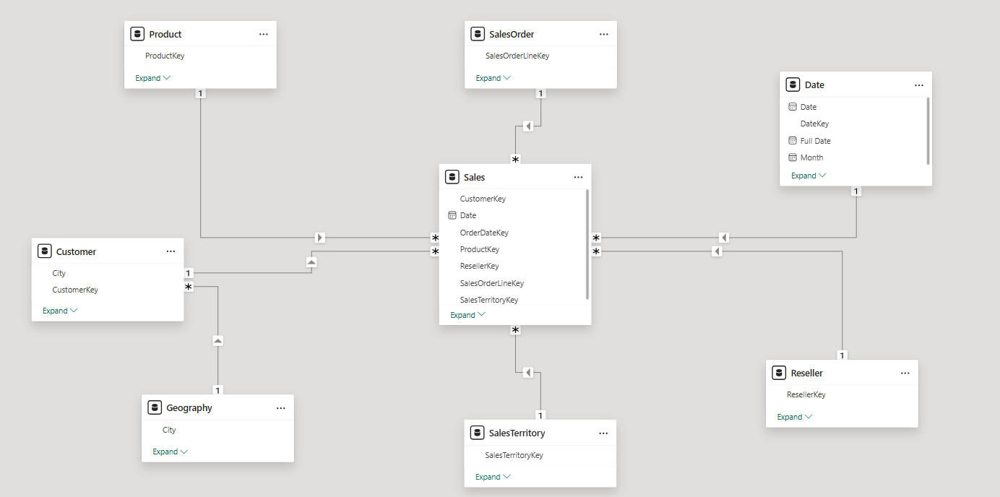
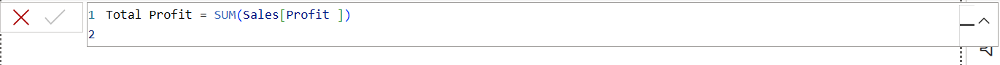
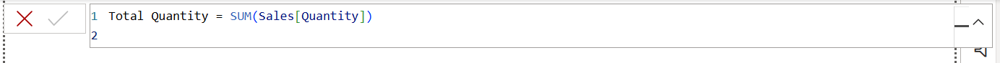
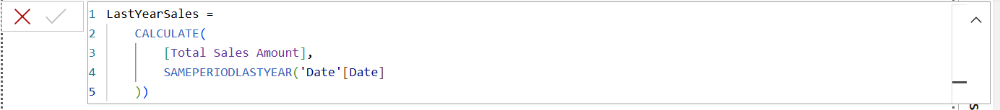
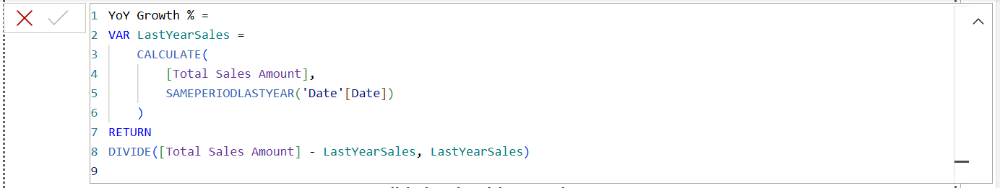
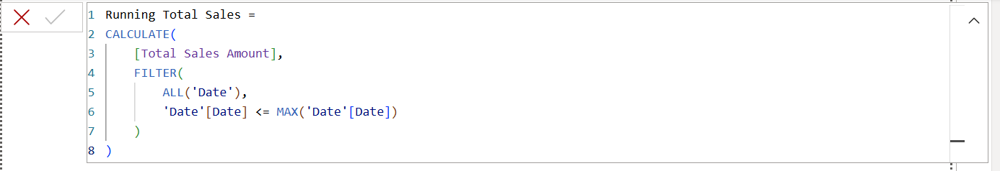
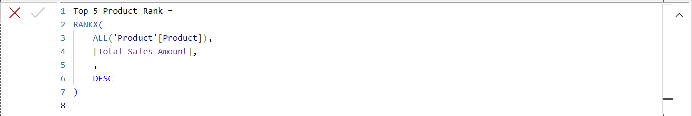
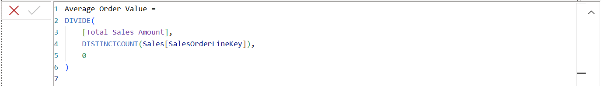
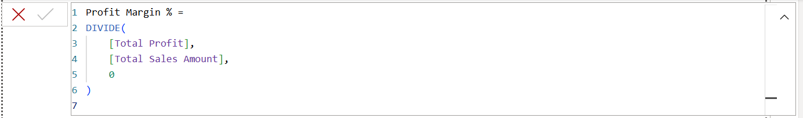

# Power BI Practical Exam – [Your Full Name]

## Project Overview
This project is my submission for the DSA3050A End Semester Exam, demonstrating end-to-end Business Intelligence development using **Power BI**.

The dataset is based on the **AdventureWorks Sales** data, consisting of transactional sales, product, customer, and date dimensions.  
The deliverables include:
- Data extraction, transformation, and loading (ETL) in Power Query
- Star schema data modeling
- Advanced DAX measures
- Interactive report pages and dashboard
- Row-Level Security (RLS)
- Full documentation with visuals and publishing

---

## Dataset Description
The project uses **AdventureWorks Sales.xlsx** containing:
- **Sales_data** – transactional sales facts
- **Product_data** – product details (cost, category, subcategory)
- **Customer_data** – customer names and locations
- **Date_data** – calendar dates, years, months
- **Sales Territory_data** – regional mapping
- Optional: **Reseller_data**, **Sales Order_data**

---

## Data Preparation (Power Query)
1. **Imported** 5 tables from Excel: Sales_data, Product_data, Customer_data, Date_data, Sales Territory_data.
2. **Changed data types** to appropriate formats (Dates, Currency, Whole Numbers).
3. **Merged Sales_data with Product_data** to create a `Profit` column.
4. **Split Customer name** into `FirstName` and `LastName`.
5. Added **Sales Category** classification based on Sales Amount thresholds.
6. Performed **monthly aggregation** in Date_data: Total Sales 


7. Removed duplicate products and filtered Sales_data for dates ≥ 2018.
8. Created an **Outliers_Summary** query for Sales Amount (99th percentile).


---

## Data Modeling
- Implemented a **Star Schema**:
  - Sales_data fact table at the center
  - Linked to Date_data, Product_data, Customer_data, Sales Territory_data
- Created **Date** and **Product** hierarchies
- Hid surrogate keys and formatted all measures



---

## Visuals Gallery
- **Bar Chart:** Top 10 Products by Sales
- **Line Chart:** Monthly Sales with 6-month Forecast
- **Pie Chart:** Sales by Category (%)
- **Map:** Sales by Country/State (bubble size = Quantity)
- **Scatter Plot:** Quantity vs Profit (play axis = Year)
- **KPI Card:** Total Sales vs Target (10% YoY growth)
- **Gauge:** Profit Margin vs Target 30%
- **Decomposition Tree:** Drill by Customer → Product → Region
- **Custom Bullet Chart:** Sales vs Budget


---

## Report Pages
### Page 1: Sales Overview
- KPI, Line Chart, Map
- Slicers synced across pages

### Page 2: Product Analysis
- Top 10 Products, Scatter Plot, Decomposition Tree
- Bookmark toggle for Top/Bottom performers

### Page 3: Customer Insights
- Customer table with conditional formatting
- Multi-row card for key metrics


---

## DAX Measures Overview
This report contains **10 optimized DAX measures** designed for advanced analysis, trend tracking and KPI monitoring.
### 1. Total Sales Amount


- Calculates total revenue from all sales transactions


### 2. Total Profit


- Calculates the total profit generated across all orders.


### 3. Total Quantity


- Calculates the total number of units sold.


### 4. LastYearSales


- Returns total sales for the same period in the previous year, enabling year-over-year comparisons.


### 5. YoY Growth %


- Calculates the percentage change in sales compared to the same period last year.


### 6. Running Total Sales


- Provides cumulative sales from the start of the date range up to the current date.


### 7. Top 5 Product Rank


-  Ranks products by sales, with 1 being the highest-selling product. Can be used to filter the top 5 products.


### 8. Average Order Value


- Shows the average revenue per order, useful for understanding customer spending patterns.


### 9. Profit Margin %


- Calculates profit as a percentage of total sales, indicating profitability efficiency.


### 10. Total Customers


- Counts unique customers who have made purchases.


## Row-Level Security (RLS) Implementation

Row-Level Security was implemented to restrict data visibility based on a user's assigned role.  
Two roles were created:

### 1. US Manager
Filters the data to only show sales where the country is **United States**.
```DAX
[Country-Region] = "United States"
```

### 2. Europe Manager
Filters the data to only show sales where the country is in the list of European countries.
```DAX
[Country-Region] IN { "France", "Germany", "Spain", "Italy", "United Kingdom" }
```