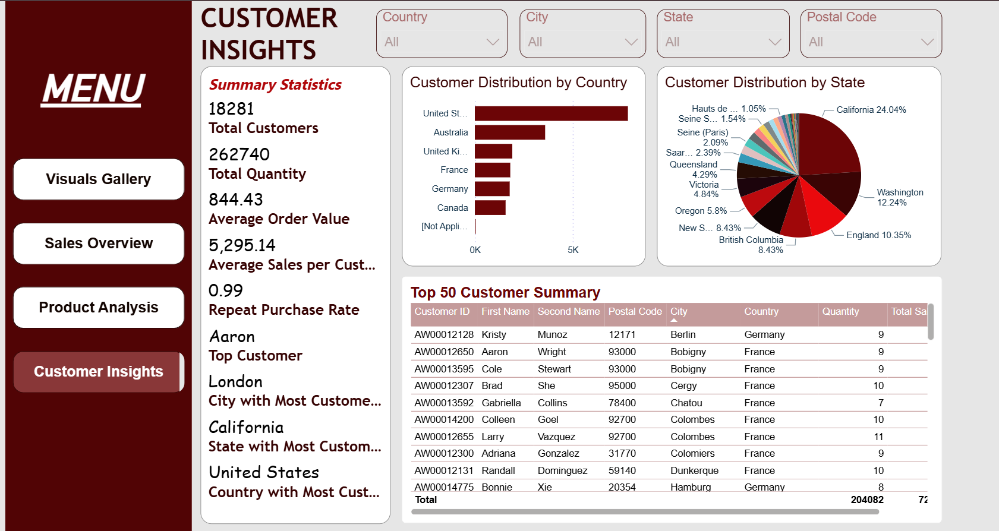
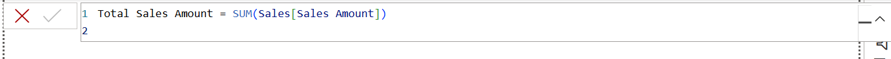
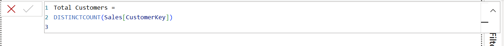
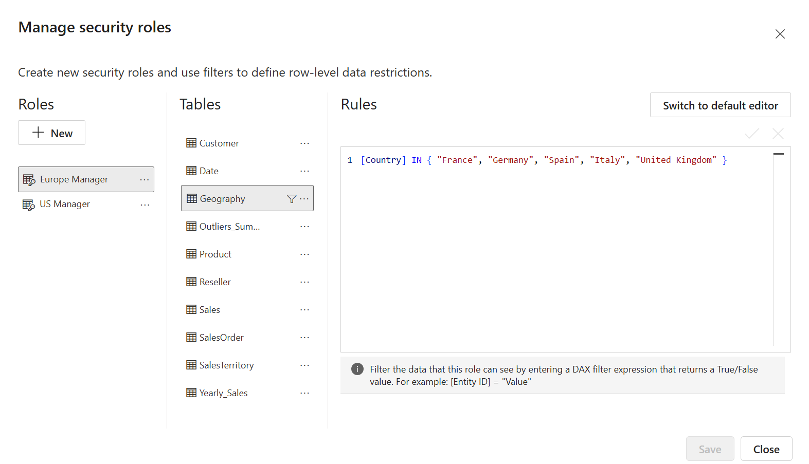

# Power BI Practical Exam – RITA

## Project Overview
This project is my submission for the DSA3050A End Semester Exam, demonstrating end-to-end Business Intelligence development using **Power BI**.

The dataset is based on the **AdventureWorks Sales** data.  
The deliverables include:
- Data extraction, transformation and loading (ETL) in Power Query
- Star schema data modeling
- Advanced DAX measures
- Interactive report pages and dashboard
- Row-Level Security (RLS)
- Full documentation with visuals and publishing


## Project Structure

```
POWERBI_PRACTICAL_EXAM/
├── screenshots/                     # All screenshots attached to README
├── PowerBI_Practical_Exam.pbix      # Power BI project file
├── Report.pdf                       # Exported Power BI report
├── AdventureWorks_Sales.xlsx        # Dataset used in the analysis
└── README.md                        # Comprehensive documentation 

```


## Section 1: Data Import and Transformation 

1. **Imported** 7 tables from Excel: Sales, Product, Customer, Date, SalesTerritory, SalesOrder, Reseller
2. **Changed data types** to appropriate formats (Dates, Currency, Whole Numbers).
3. **Merged Sales with Product** to create a `Profit` column.


4. **Split Customer name** into `FirstName` and `LastName`.


5. Added **Sales Category** classification based on Sales Amount thresholds.


6. Removed duplicate products and filtered Sales for dates ≥ 2018.


7. Performed **yearly aggregation** and created Yearly_Sales table.


8. Created an **Outliers_Summary** query for Sales Amount (99th percentile).


9. Duplicated Customer's table, removed some columns and created Geography table.


## Section 2: Data Modeling 

- Implemented a **Star Schema**:


  - Sales fact table at the center
  - Linked to Product, Customer, Date, SalesTerritory, SalesOrder, Reseller
  - Geography table links to Customer
- Created **Date** and **Product** hierarchies
- Formatted all measures


## Section 3: Creating Visualizations 
### Visuals Gallery
**Purpose:** A collection of different charts and graphs used to represent data.


**Key Features:**
- **Yearly Total Sales**: Bar chart comparing sales across different years.  
- **Profit Margin with 30% Target**: Donut chart showing KPI progress towards a profit margin goal.  
- **Total Sales Amount and Target**: Card visual highlighting a key sales metric and its target comparison.  
- **Monthly Sales Trend**: Line graph illustrating sales trends across months of the year.  
- **Quantity vs Profit (by Category) with Play Axis (Year)**: Scatter plot showing the relationship between quantity and profit, animated by year.  
- **Top 10 Products by Sales Amount**: Bar chart ranking the best-performing products by sales.  


## Section 4: Building Reports and Dashboards

### Page 1: Sales Overview
**Purpose:** Monitor overall sales performance, profit margins, and product sales distribution.  


**Key Features:**
- **Total Sales, Target Sales, Profit Margin %, Total Profit** KPIs
- **Sales Category Distribution** (High, Medium, Low segments)
- **Monthly Sales Trend** with Total Sales Amount vs Quantity
- **Top 10 Products by Sales Amount**
- **Top 50 Sales Transactions** table with details (Sales Order, Year, Month, Channel, Region, Total Quantity, Total Sales)


### Page 2: Product Analysis
**Purpose:** Analyze product performance across categories, subcategories, and colors to identify top-selling products and trends.  


**Key Features:**
- **Product Sales Analysis** by Product, Category, Subcategory, Color, City, State, Country, date, Total Quantity, Total Sales.
- **Decomposition Tree** for Total Sales Amount by Product and City Model 
- **Top Product Performers**
  - **Top Category:** Bikes ($83.36M)  
  - **Top Subcategory:** Road Bikes ($37.87M)  
  - **Top Color:** Black ($34.74M)
- **Category Rank Over Time** – Monthly performance trends for product categories


### Page 3: Customer Insights
**Purpose:** Understand customer distribution, purchasing behavior, and identify top customers. 



**Key Features:**
- **Summary Statistics**
  - Total Customers: 18,281  
  - Total Quantity: 262,740  
  - Average Order Value: 844.43  
  - Repeat Purchase Rate: 0.99  
- **Customer Distribution by Country & State**
- **Top Customer Insights** (Top Customer: Aaron, City: London, State: California, Country: USA)
- **Top 50 Customer Summary** with Customer ID, Name, Location, Quantity, Total Sales


### Executive Dashboard

After publishing the Power BI report to the **Power BI Service**, I created an **Executive Business Performance Dashboard**.  
This dashboard consolidates **Sales Overview, Product Analysis, and Customer Insights** into a single interactive view for decision-makers.  

####  Key Features Implemented
- **Pinned Visuals**: Selected KPIs and charts (e.g., Top Products, Yearly Total Sales, Monthly Sales Tend) pinned from the reports.  


- **Quick Insights (Q&A)**: Added a natural language tile answering queries such as *"Top product by Currency"*.  
- **Consistent Theme**: Used the same theme as the other dashboards.  
- **Mobile Layout Optimization**: Configured the mobile view so executives can track KPIs and trends seamlessly on their devices. 


 

This ensures the dashboard is **engaging, accessible and aligned with business needs** across both desktop and mobile platforms.


## Section 5: Advanced Features and DAX

### DAX Measures Overview
This report contains **15 optimized DAX measures** designed for advanced analysis, trend tracking and KPI monitoring.
#### 1. Total Sales Amount
- Calculates total revenue from all sales transactions



#### 2. Total Profit
- Calculates the total profit generated across all orders.


#### 3. Total Quantity
- Calculates the total number of units sold.


#### 4. LastYearSales
- Returns total sales for the same period in the previous year, enabling year-over-year comparisons.


#### 5. YoY Growth %
- Calculates the percentage change in sales compared to the same period last year.


#### 6. Running Total Sales
- Provides cumulative sales from the start of the date range up to the current date.


#### 7. Top 5 Product Rank
-  Ranks products by sales, with 1 being the highest-selling product. Can be used to filter the top 5 products.


#### 8. Average Order Value
- Shows the average revenue per order, useful for understanding customer spending patterns.


#### 9. Profit Margin %
- Calculates profit as a percentage of total sales, indicating profitability efficiency.


#### 10. Total Customers
- Counts unique customers who have made purchases.



#### 11. Average Sales per Customer
- Calculates the total sales amount divided by the distinct number of customers.


#### 12.  Repeat Purchase Rate
- Measures the percentage of customers who have made more than one purchase.


#### 13. State with Most Customers
- Identifies the state with the highest number of distinct customers.


#### 14. City with Most Customers
- Identifies the city with the highest number of distinct customers.


#### 15. Country with Most Customers
- Identifies the country with the highest number of distinct customers.


## Row-Level Security (RLS) Implementation

Row-Level Security was implemented to restrict data visibility based on a user's assigned role.  
Two roles were created:

### 1. US Manager
Filters the data to only show sales where the country is **United States**.


- Viewing as US Manager: 


### 2. Europe Manager
Filters the data to only show sales where the country is in the list of European countries.


- Viewing as Europe Manager:


### Assumptions & Limitations
#### Assumptions
- The AdventureWorks dataset provided is complete, accurate, and representative of actual business operations.
- All required business rules (e.g., Profit = SalesAmount – Quantity × Cost, Sales Category thresholds) are correct and accepted by stakeholders.
- The provided time period (2018 onwards) sufficiently reflects current sales trends for meaningful analysis.
- Power BI Service and user accounts are assumed to have the necessary licenses and permissions for publishing, sharing and applying Row-Level Security (RLS).
#### Limitations
- Historical data prior to 2018 is excluded, which may limit long-term trend analysis and seasonality insights.
- Outlier handling is limited to the 99th percentile filter; additional data quality checks may be required in production.
- Performance testing on very large datasets was not conducted, so scalability in enterprise-scale environments is unverified.
-	Custom visuals used in the report may have licensing or compatibility restrictions in different Power BI environments


## Published Dashboard
[Click to View Live Report](https://app.powerbi.com/reportEmbed?reportId=586822c8-33c2-4c86-b771-543cfcc23819&autoAuth=true&ctid=16d83ee6-254a-469d-a6cc-54e2ca2313e7)
